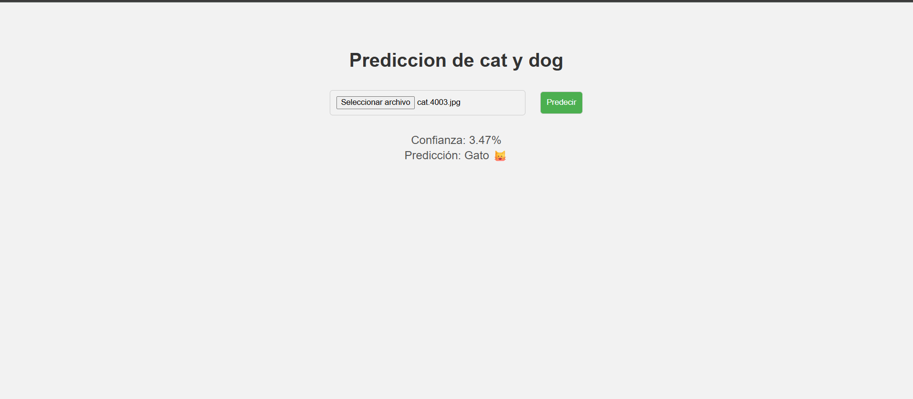
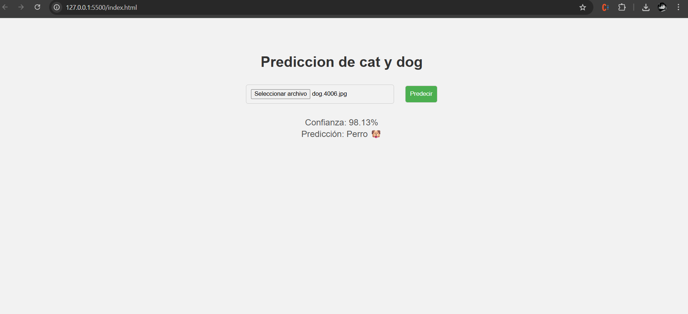

**RED CONVULCIONAL** 

DESCRIPCION:
se tenia que hacer una red convulucional o perceptron en la cual yo la red convulcional con imagenes 

primeramente yo ise en mi colab fue instalar mi tensorflowjs y en la cual para no tener fallas instale el tensor 2.15 pero lo ejecute asi **!pip install tensorflow==2.15.0 tensorflowjs**
y esto nos sirve para convertirlo en tensorflowjs y asi para la exportacion a web 

**PRUEBAS DE PREDICCION**

**LINK DE COLAB**

https://colab.research.google.com/drive/1kyCWBxm1wodFIVkwSbLpYD7b0a-R0Zau?usp=sharing
